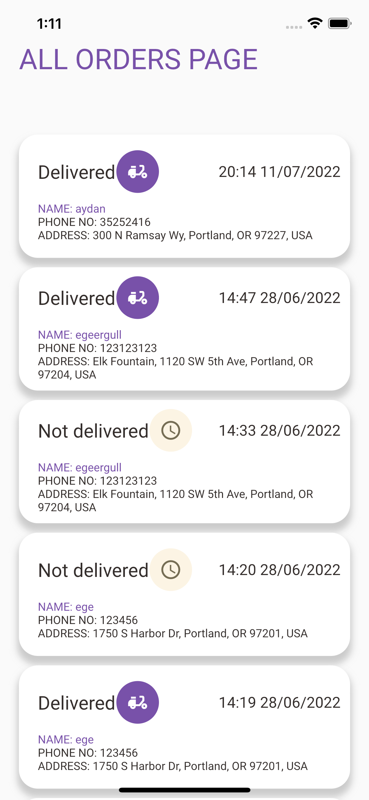
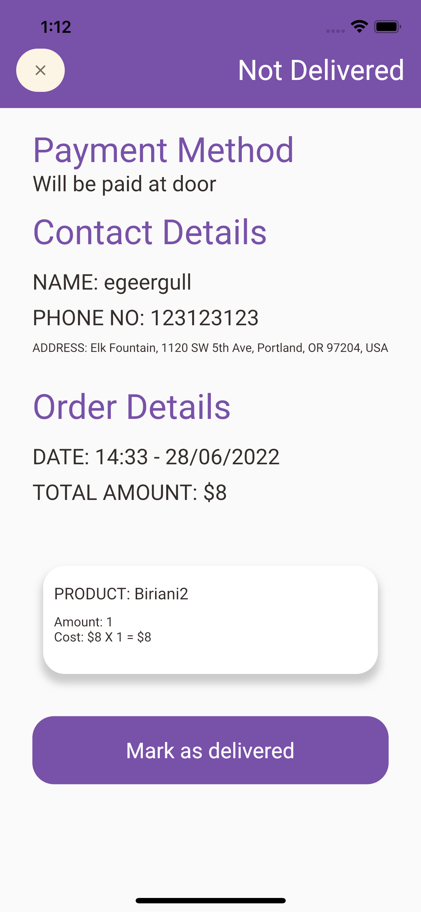

# Food Delivery App Driver Panel

This panel is to be used by the drivers of the seller. When a new order arrives, the drivers 
receive an email to their registered email addresses. Also, they can see the new update from this app 
too. With this app, they can see the details of the order. Also when they deliver the order, they mark it
as delivered so no other drivers delivers it again.

## Features
<ul>
    <li>Receive email when new order arrives</li>
    <li>See old and new orders</li>
    <li>See the info of order's owner</li>
    <li>See which of the products does the order include</li>
    <li>See if the order is already paid or will be paid at door</li>
    <li>Mark the order as delivered</li>
</ul>

## Images from the app

This screen is the main screen of this panel. Here, drivers can see all of the new and old orders

 
 

This screen is an example undelivered order where drivers can see the order info and user info.

## Getting Started

coming soon...

